# Architecture Documentation

## GenAI Boilerplate .NET - System Architecture

This document provides a comprehensive overview of the GenAI Boilerplate .NET application architecture, including high-level design, low-level design, data models, network topology, deployment architecture, and key workflow diagrams.

## Table of Contents

1. [System Overview](#system-overview)
2. [High-Level Design (HLD)](#high-level-design-hld)
3. [Low-Level Design (LLD)](#low-level-design-lld)
4. [Component Architecture](#component-architecture)
5. [Data Model](#data-model)
6. [Network Architecture](#network-architecture)
7. [Deployment Architecture](#deployment-architecture)
8. [Activity Diagrams](#activity-diagrams)
9. [Security Architecture](#security-architecture)
10. [Technology Stack](#technology-stack)

---

## System Overview

The GenAI Boilerplate .NET is a multi-tenant SaaS application that provides AI-powered chat capabilities with a modern tech stack including ASP.NET Core Web API, React frontend, PostgreSQL database, and Redis cache.

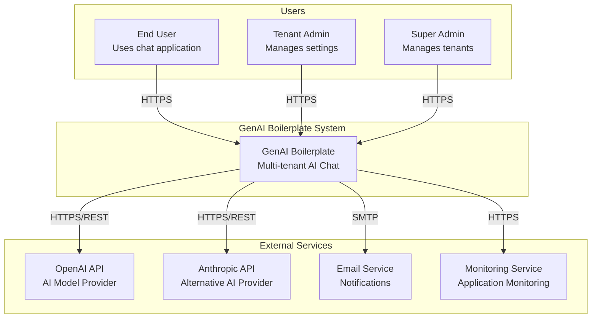
```mermaid
graph TB
    subgraph "Users"
        USER[End User<br/>Uses chat application]
        ADMIN[Tenant Admin<br/>Manages settings]
        SUPER[Super Admin<br/>Manages tenants]
    end

    subgraph "GenAI Boilerplate System"
        APP[GenAI Boilerplate<br/>Multi-tenant AI Chat]
    end

    subgraph "External Services"
        OPENAI[OpenAI API<br/>AI Model Provider]
        ANTHROPIC[Anthropic API<br/>Alternative AI Provider]
        EMAIL[Email Service<br/>Notifications]
        MONITORING[Monitoring Service<br/>Application Monitoring]
    end

    USER -->|HTTPS| APP
    ADMIN -->|HTTPS| APP
    SUPER -->|HTTPS| APP
    
    APP -->|HTTPS/REST| OPENAI
    APP -->|HTTPS/REST| ANTHROPIC
    APP -->|SMTP| EMAIL
    APP -->|HTTPS| MONITORING
```

---

## High-Level Design (HLD)

### System Architecture Overview

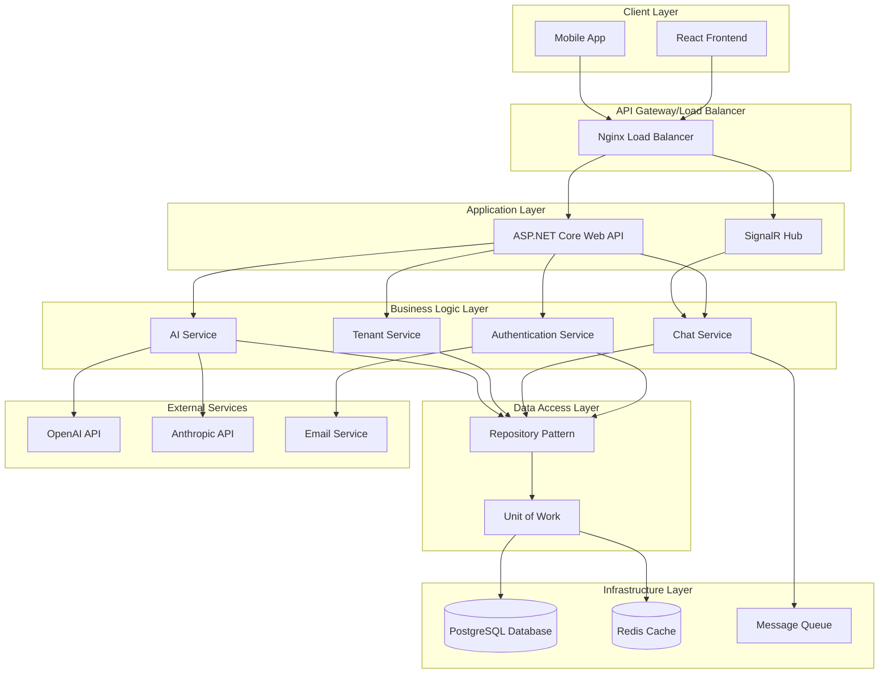
```mermaid
graph TB
    subgraph "Client Layer"
        WEB[React Frontend]
        MOBILE[Mobile App]
    end

    subgraph "API Gateway/Load Balancer"
        LB[Nginx Load Balancer]
    end

    subgraph "Application Layer"
        API[ASP.NET Core Web API]
        HUB[SignalR Hub]
    end

    subgraph "Business Logic Layer"
        AUTH[Authentication Service]
        CHAT[Chat Service]
        TENANT[Tenant Service]
        AI[AI Service]
    end

    subgraph "Data Access Layer"
        REPO[Repository Pattern]
        UOW[Unit of Work]
    end

    subgraph "Infrastructure Layer"
        DB[(PostgreSQL Database)]
        CACHE[(Redis Cache)]
        QUEUE[Message Queue]
    end

    subgraph "External Services"
        OPENAI[OpenAI API]
        ANTHRO[Anthropic API]
        EMAIL[Email Service]
    end

    WEB --> LB
    MOBILE --> LB
    LB --> API
    LB --> HUB
    
    API --> AUTH
    API --> CHAT
    API --> TENANT
    API --> AI
    
    HUB --> CHAT
    
    AUTH --> REPO
    CHAT --> REPO
    TENANT --> REPO
    AI --> REPO
    
    REPO --> UOW
    UOW --> DB
    UOW --> CACHE
    
    AI --> OPENAI
    AI --> ANTHRO
    AUTH --> EMAIL
    
    CHAT --> QUEUE
```

### Technology Stack Overview

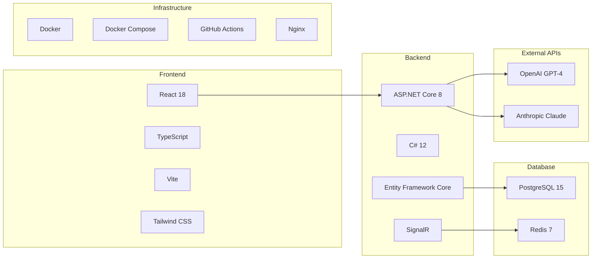
```mermaid
graph LR
    subgraph "Frontend"
        A[React 18]
        B[TypeScript]
        C[Vite]
        D[Tailwind CSS]
    end

    subgraph "Backend"
        E[ASP.NET Core 8]
        F[C# 12]
        G[Entity Framework Core]
        H[SignalR]
    end

    subgraph "Database"
        I[PostgreSQL 15]
        J[Redis 7]
    end

    subgraph "Infrastructure"
        K[Docker]
        L[Docker Compose]
        M[GitHub Actions]
        N[Nginx]
    end

    subgraph "External APIs"
        O[OpenAI GPT-4]
        P[Anthropic Claude]
    end

    A --> E
    G --> I
    H --> J
    E --> O
    E --> P
```

---

## Low-Level Design (LLD)

### API Layer Architecture

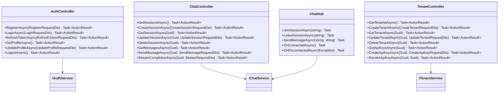
```mermaid
classDiagram
    class AuthController {
        +RegisterAsync(RegisterRequestDto) Task~ActionResult~
        +LoginAsync(LoginRequestDto) Task~ActionResult~
        +RefreshTokenAsync(RefreshTokenRequestDto) Task~ActionResult~
        +GetProfileAsync() Task~ActionResult~
        +UpdateProfileAsync(UpdateProfileRequestDto) Task~ActionResult~
        +LogoutAsync() Task~ActionResult~
    }

    class ChatController {
        +GetSessionsAsync() Task~ActionResult~
        +CreateSessionAsync(CreateSessionRequestDto) Task~ActionResult~
        +GetSessionAsync(Guid) Task~ActionResult~
        +UpdateSessionAsync(Guid, UpdateSessionRequestDto) Task~ActionResult~
        +DeleteSessionAsync(Guid) Task~ActionResult~
        +GetMessagesAsync(Guid) Task~ActionResult~
        +SendMessageAsync(Guid, SendMessageRequestDto) Task~ActionResult~
        +StreamCompletionAsync(Guid, StreamRequestDto) Task~ActionResult~
    }

    class TenantController {
        +GetTenantsAsync() Task~ActionResult~
        +CreateTenantAsync(CreateTenantRequestDto) Task~ActionResult~
        +GetTenantAsync(Guid) Task~ActionResult~
        +UpdateTenantAsync(Guid, UpdateTenantRequestDto) Task~ActionResult~
        +DeleteTenantAsync(Guid) Task~ActionResult~
        +GetApiKeysAsync(Guid) Task~ActionResult~
        +CreateApiKeyAsync(Guid, CreateApiKeyRequestDto) Task~ActionResult~
        +RevokeApiKeyAsync(Guid, Guid) Task~ActionResult~
    }

    class ChatHub {
        +JoinSessionAsync(string) Task
        +LeaveSessionAsync(string) Task
        +SendMessageAsync(string, string) Task
        +OnConnectedAsync() Task
        +OnDisconnectedAsync(Exception) Task
    }

    AuthController --> IAuthService
    ChatController --> IChatService
    TenantController --> ITenantService
    ChatHub --> IChatService
```

### Service Layer Architecture

```mermaid
classDiagram
    class IAuthService {
        <<interface>>
        +RegisterAsync(RegisterRequestDto) Task~UserResponseDto~
        +LoginAsync(LoginRequestDto) Task~TokenResponseDto~
        +RefreshTokenAsync(string) Task~TokenResponseDto~
        +GetUserByIdAsync(Guid) Task~UserResponseDto~
        +UpdateUserAsync(Guid, UpdateProfileRequestDto) Task~UserResponseDto~
        +RevokeRefreshTokenAsync(string) Task
    }

    class IChatService {
        <<interface>>
        +GetUserSessionsAsync(Guid) Task~IEnumerable~ChatSessionDto~~
        +CreateSessionAsync(Guid, CreateSessionRequestDto) Task~ChatSessionDto~
        +GetSessionAsync(Guid) Task~ChatSessionDto~
        +UpdateSessionAsync(Guid, UpdateSessionRequestDto) Task~ChatSessionDto~
        +DeleteSessionAsync(Guid) Task
        +GetSessionMessagesAsync(Guid) Task~IEnumerable~ChatMessageDto~~
        +SendMessageAsync(Guid, SendMessageRequestDto) Task~ChatMessageDto~
    }

    class ITenantService {
        <<interface>>
        +GetTenantsAsync() Task~IEnumerable~TenantDto~~
        +CreateTenantAsync(CreateTenantRequestDto) Task~TenantDto~
        +GetTenantAsync(Guid) Task~TenantDto~
        +UpdateTenantAsync(Guid, UpdateTenantRequestDto) Task~TenantDto~
        +DeleteTenantAsync(Guid) Task
        +GetTenantApiKeysAsync(Guid) Task~IEnumerable~TenantApiKeyDto~~
        +CreateTenantApiKeyAsync(Guid, CreateApiKeyRequestDto) Task~TenantApiKeyDto~
        +RevokeTenantApiKeyAsync(Guid) Task
    }

    class IAIService {
        <<interface>>
        +GetCompletionAsync(string, ChatCompletionRequest) Task~ChatCompletionResponse~
        +GetStreamingCompletionAsync(string, ChatCompletionRequest) IAsyncEnumerable~string~
        +GetAvailableModelsAsync(string) Task~IEnumerable~string~~
    }

    class AuthService {
        -IUnitOfWork _unitOfWork
        -IJwtService _jwtService
        -IPasswordHasher _passwordHasher
        +RegisterAsync(RegisterRequestDto) Task~UserResponseDto~
        +LoginAsync(LoginRequestDto) Task~TokenResponseDto~
        +RefreshTokenAsync(string) Task~TokenResponseDto~
    }

    class ChatService {
        -IUnitOfWork _unitOfWork
        -IAIService _aiService
        +GetUserSessionsAsync(Guid) Task~IEnumerable~ChatSessionDto~~
        +CreateSessionAsync(Guid, CreateSessionRequestDto) Task~ChatSessionDto~
        +SendMessageAsync(Guid, SendMessageRequestDto) Task~ChatMessageDto~
    }

    class TenantService {
        -IUnitOfWork _unitOfWork
        +GetTenantsAsync() Task~IEnumerable~TenantDto~~
        +CreateTenantAsync(CreateTenantRequestDto) Task~TenantDto~
        +UpdateTenantAsync(Guid, UpdateTenantRequestDto) Task~TenantDto~
    }

    class AIService {
        -Dictionary~string,IAIProvider~ _providers
        +GetCompletionAsync(string, ChatCompletionRequest) Task~ChatCompletionResponse~
        +GetStreamingCompletionAsync(string, ChatCompletionRequest) IAsyncEnumerable~string~
    }

    IAuthService <|.. AuthService
    IChatService <|.. ChatService
    ITenantService <|.. TenantService
    IAIService <|.. AIService
```

### Data Access Layer

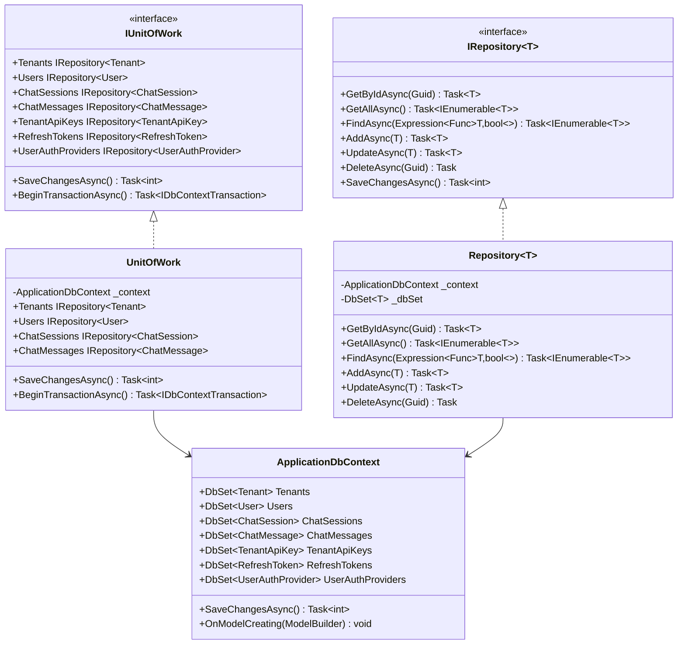
```mermaid
classDiagram
    class IRepository~T~ {
        <<interface>>
        +GetByIdAsync(Guid) Task~T~
        +GetAllAsync() Task~IEnumerable~T~~
        +FindAsync(Expression~Func~T,bool~~) Task~IEnumerable~T~~
        +AddAsync(T) Task~T~
        +UpdateAsync(T) Task~T~
        +DeleteAsync(Guid) Task
        +SaveChangesAsync() Task~int~
    }

    class IUnitOfWork {
        <<interface>>
        +Tenants IRepository~Tenant~
        +Users IRepository~User~
        +ChatSessions IRepository~ChatSession~
        +ChatMessages IRepository~ChatMessage~
        +TenantApiKeys IRepository~TenantApiKey~
        +RefreshTokens IRepository~RefreshToken~
        +UserAuthProviders IRepository~UserAuthProvider~
        +SaveChangesAsync() Task~int~
        +BeginTransactionAsync() Task~IDbContextTransaction~
    }

    class Repository~T~ {
        -ApplicationDbContext _context
        -DbSet~T~ _dbSet
        +GetByIdAsync(Guid) Task~T~
        +GetAllAsync() Task~IEnumerable~T~~
        +FindAsync(Expression~Func~T,bool~~) Task~IEnumerable~T~~
        +AddAsync(T) Task~T~
        +UpdateAsync(T) Task~T~
        +DeleteAsync(Guid) Task
    }

    class UnitOfWork {
        -ApplicationDbContext _context
        +Tenants IRepository~Tenant~
        +Users IRepository~User~
        +ChatSessions IRepository~ChatSession~
        +ChatMessages IRepository~ChatMessage~
        +SaveChangesAsync() Task~int~
        +BeginTransactionAsync() Task~IDbContextTransaction~
    }

    class ApplicationDbContext {
        +DbSet~Tenant~ Tenants
        +DbSet~User~ Users
        +DbSet~ChatSession~ ChatSessions
        +DbSet~ChatMessage~ ChatMessages
        +DbSet~TenantApiKey~ TenantApiKeys
        +DbSet~RefreshToken~ RefreshTokens
        +DbSet~UserAuthProvider~ UserAuthProviders
        +SaveChangesAsync() Task~int~
        +OnModelCreating(ModelBuilder) void
    }

    IRepository~T~ <|.. Repository~T~
    IUnitOfWork <|.. UnitOfWork
    UnitOfWork --> ApplicationDbContext
    Repository~T~ --> ApplicationDbContext
```

---

## Component Architecture

### Clean Architecture Layers

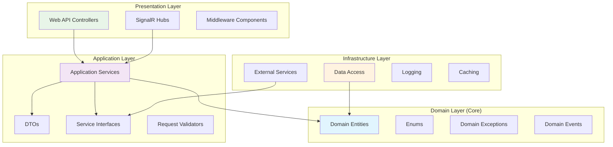
```mermaid
graph TB
    subgraph "Presentation Layer"
        API[Web API Controllers]
        HUB[SignalR Hubs]
        MIDDLEWARE[Middleware Components]
    end

    subgraph "Application Layer"
        SERVICES[Application Services]
        DTOS[DTOs]
        INTERFACES[Service Interfaces]
        VALIDATORS[Request Validators]
    end

    subgraph "Domain Layer (Core)"
        ENTITIES[Domain Entities]
        ENUMS[Enums]
        EXCEPTIONS[Domain Exceptions]
        EVENTS[Domain Events]
    end

    subgraph "Infrastructure Layer"
        DATAACCESS[Data Access]
        EXTERNAL[External Services]
        LOGGING[Logging]
        CACHING[Caching]
    end

    API --> SERVICES
    HUB --> SERVICES
    SERVICES --> INTERFACES
    SERVICES --> DTOS
    SERVICES --> ENTITIES
    DATAACCESS --> ENTITIES
    EXTERNAL --> INTERFACES

    style ENTITIES fill:#e1f5fe
    style SERVICES fill:#f3e5f5
    style API fill:#e8f5e8
    style DATAACCESS fill:#fff3e0
```

### Dependency Injection Container

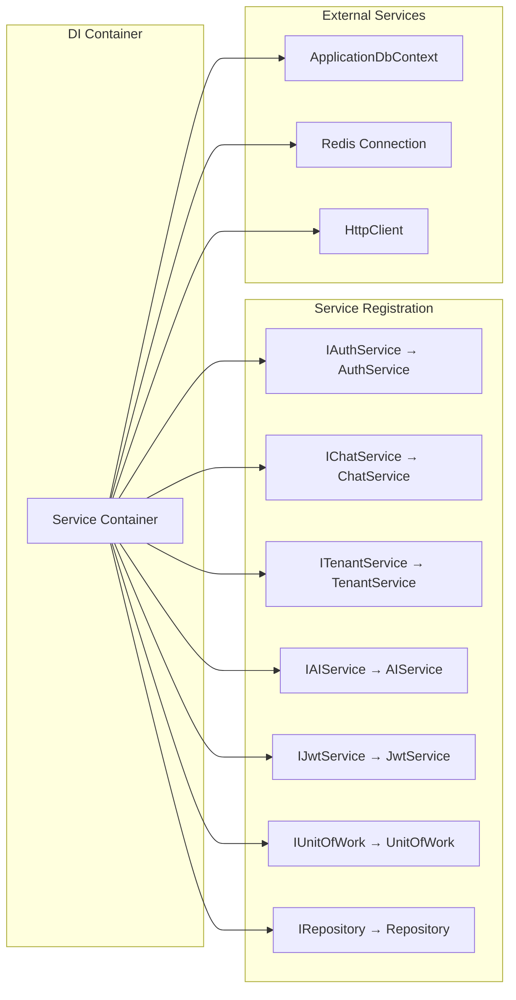
```mermaid
graph LR
    subgraph "DI Container"
        CONTAINER[Service Container]
    end

    subgraph "Service Registration"
        AUTH_REG[IAuthService → AuthService]
        CHAT_REG[IChatService → ChatService]
        TENANT_REG[ITenantService → TenantService]
        AI_REG[IAIService → AIService]
        JWT_REG[IJwtService → JwtService]
        UOW_REG[IUnitOfWork → UnitOfWork]
        REPO_REG[IRepository → Repository]
    end

    subgraph "External Services"
        DB_REG[ApplicationDbContext]
        REDIS_REG[Redis Connection]
        HTTP_REG[HttpClient]
    end

    CONTAINER --> AUTH_REG
    CONTAINER --> CHAT_REG
    CONTAINER --> TENANT_REG
    CONTAINER --> AI_REG
    CONTAINER --> JWT_REG
    CONTAINER --> UOW_REG
    CONTAINER --> REPO_REG
    CONTAINER --> DB_REG
    CONTAINER --> REDIS_REG
    CONTAINER --> HTTP_REG
```

---

## Data Model

### Entity Relationship Diagram

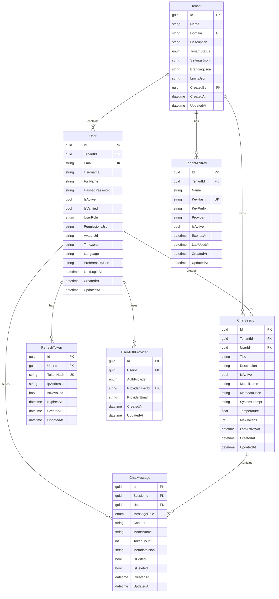
```mermaid
erDiagram
    Tenant ||--o{ User : contains
    Tenant ||--o{ TenantApiKey : has
    Tenant ||--o{ ChatSession : owns
    
    User ||--o{ ChatSession : creates
    User ||--o{ ChatMessage : sends
    User ||--o{ RefreshToken : has
    User ||--o{ UserAuthProvider : uses
    
    ChatSession ||--o{ ChatMessage : contains
    
    Tenant {
        guid Id PK
        string Name
        string Domain UK
        string Description
        enum TenantStatus
        string SettingsJson
        string BrandingJson
        string LimitsJson
        guid CreatedBy FK
        datetime CreatedAt
        datetime UpdatedAt
    }
    
    User {
        guid Id PK
        guid TenantId FK
        string Email UK
        string Username
        string FullName
        string HashedPassword
        bool IsActive
        bool IsVerified
        enum UserRole
        string PermissionsJson
        string AvatarUrl
        string Timezone
        string Language
        string PreferencesJson
        datetime LastLoginAt
        datetime CreatedAt
        datetime UpdatedAt
    }
    
    ChatSession {
        guid Id PK
        guid TenantId FK
        guid UserId FK
        string Title
        string Description
        bool IsActive
        string ModelName
        string MetadataJson
        string SystemPrompt
        float Temperature
        int MaxTokens
        datetime LastActivityAt
        datetime CreatedAt
        datetime UpdatedAt
    }
    
    ChatMessage {
        guid Id PK
        guid SessionId FK
        guid UserId FK
        enum MessageRole
        string Content
        string ModelName
        int TokenCount
        string MetadataJson
        bool IsEdited
        bool IsDeleted
        datetime CreatedAt
        datetime UpdatedAt
    }
    
    TenantApiKey {
        guid Id PK
        guid TenantId FK
        string Name
        string KeyHash UK
        string KeyPrefix
        string Provider
        bool IsActive
        datetime ExpiresAt
        datetime LastUsedAt
        datetime CreatedAt
        datetime UpdatedAt
    }
    
    RefreshToken {
        guid Id PK
        guid UserId FK
        string TokenHash UK
        string IpAddress
        bool IsRevoked
        datetime ExpiresAt
        datetime CreatedAt
        datetime UpdatedAt
    }
    
    UserAuthProvider {
        guid Id PK
        guid UserId FK
        enum AuthProvider
        string ProviderUserId UK
        string ProviderEmail
        datetime CreatedAt
        datetime UpdatedAt
    }
```

### Database Schema Design

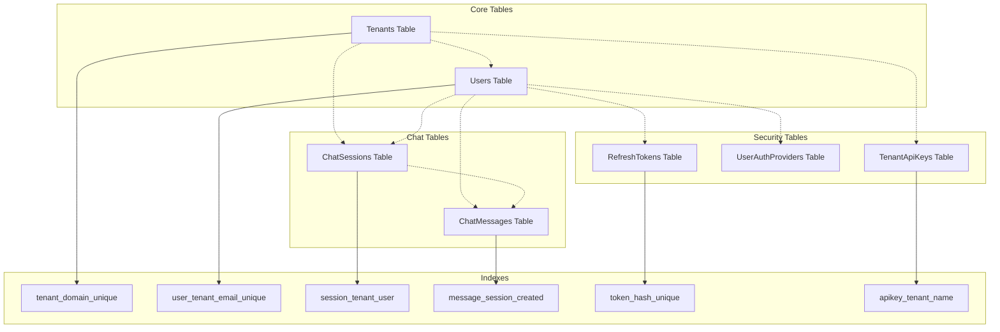
```mermaid
graph TB
    subgraph "Core Tables"
        TENANTS[Tenants Table]
        USERS[Users Table]
    end

    subgraph "Chat Tables"
        SESSIONS[ChatSessions Table]
        MESSAGES[ChatMessages Table]
    end

    subgraph "Security Tables"
        TOKENS[RefreshTokens Table]
        PROVIDERS[UserAuthProviders Table]
        APIKEYS[TenantApiKeys Table]
    end

    subgraph "Indexes"
        IDX1[tenant_domain_unique]
        IDX2[user_tenant_email_unique]
        IDX3[session_tenant_user]
        IDX4[message_session_created]
        IDX5[token_hash_unique]
        IDX6[apikey_tenant_name]
    end

    TENANTS --> IDX1
    USERS --> IDX2
    SESSIONS --> IDX3
    MESSAGES --> IDX4
    TOKENS --> IDX5
    APIKEYS --> IDX6

    TENANTS -.-> USERS
    TENANTS -.-> SESSIONS
    TENANTS -.-> APIKEYS
    USERS -.-> SESSIONS
    USERS -.-> MESSAGES
    USERS -.-> TOKENS
    USERS -.-> PROVIDERS
    SESSIONS -.-> MESSAGES
```

---

## Network Architecture

### Development Network Topology

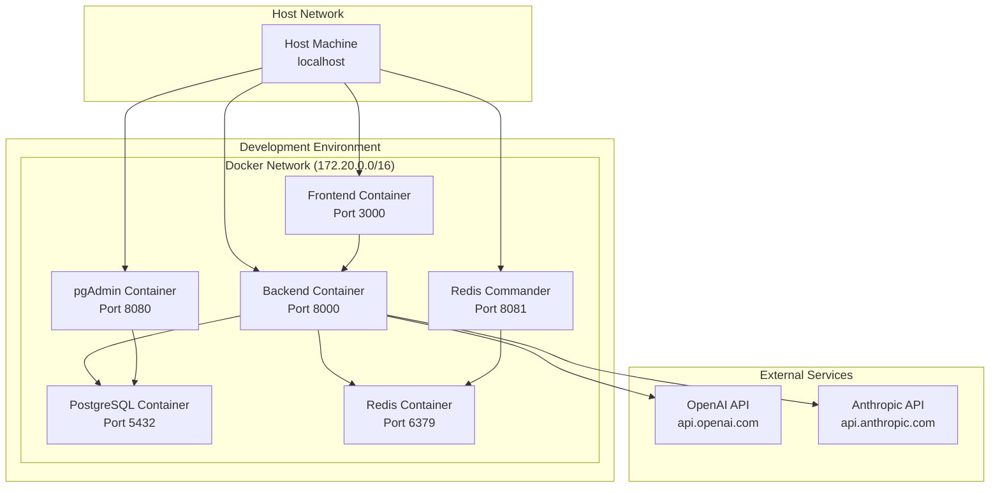
```mermaid
graph TB
    subgraph "Development Environment"
        subgraph "Docker Network (172.20.0.0/16)"
            FRONTEND[Frontend Container<br/>Port 3000]
            BACKEND[Backend Container<br/>Port 8000]
            POSTGRES[PostgreSQL Container<br/>Port 5432]
            REDIS[Redis Container<br/>Port 6379]
            PGADMIN[pgAdmin Container<br/>Port 8080]
            REDISCMD[Redis Commander<br/>Port 8081]
        end
    end

    subgraph "Host Network"
        HOST[Host Machine<br/>localhost]
    end

    subgraph "External Services"
        OPENAI[OpenAI API<br/>api.openai.com]
        ANTHROPIC[Anthropic API<br/>api.anthropic.com]
    end

    HOST --> FRONTEND
    HOST --> BACKEND
    HOST --> PGADMIN
    HOST --> REDISCMD

    FRONTEND --> BACKEND
    BACKEND --> POSTGRES
    BACKEND --> REDIS
    BACKEND --> OPENAI
    BACKEND --> ANTHROPIC

    PGADMIN --> POSTGRES
    REDISCMD --> REDIS
```

### Production Network Topology

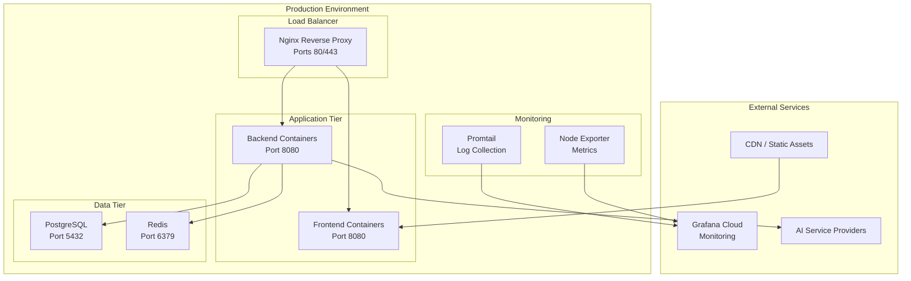
```mermaid
graph TB
    subgraph "Production Environment"
        subgraph "Load Balancer"
            NGINX[Nginx Reverse Proxy<br/>Ports 80/443]
        end

        subgraph "Application Tier"
            FRONTEND_PROD[Frontend Containers<br/>Port 8080]
            BACKEND_PROD[Backend Containers<br/>Port 8080]
        end

        subgraph "Data Tier"
            POSTGRES_PROD[PostgreSQL<br/>Port 5432]
            REDIS_PROD[Redis<br/>Port 6379]
        end

        subgraph "Monitoring"
            PROMTAIL[Promtail<br/>Log Collection]
            NODE_EXP[Node Exporter<br/>Metrics]
        end
    end

    subgraph "External Services"
        CDN[CDN / Static Assets]
        MONITORING[Grafana Cloud<br/>Monitoring]
        AI_SERVICES[AI Service Providers]
    end

    NGINX --> FRONTEND_PROD
    NGINX --> BACKEND_PROD
    BACKEND_PROD --> POSTGRES_PROD
    BACKEND_PROD --> REDIS_PROD
    BACKEND_PROD --> AI_SERVICES

    PROMTAIL --> MONITORING
    NODE_EXP --> MONITORING

    CDN --> FRONTEND_PROD
```

### Security Network Zones

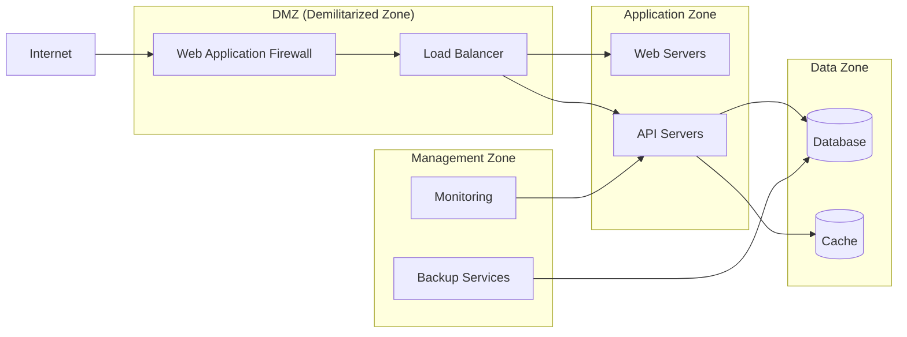
```mermaid
graph LR
    subgraph "DMZ (Demilitarized Zone)"
        LB[Load Balancer]
        FW[Web Application Firewall]
    end

    subgraph "Application Zone"
        WEB[Web Servers]
        API[API Servers]
    end

    subgraph "Data Zone"
        DB[(Database)]
        CACHE[(Cache)]
    end

    subgraph "Management Zone"
        MONITOR[Monitoring]
        BACKUP[Backup Services]
    end

    INTERNET[Internet] --> FW
    FW --> LB
    LB --> WEB
    LB --> API
    API --> DB
    API --> CACHE
    
    MONITOR --> API
    BACKUP --> DB
```

---

## Deployment Architecture

### Docker Compose Development

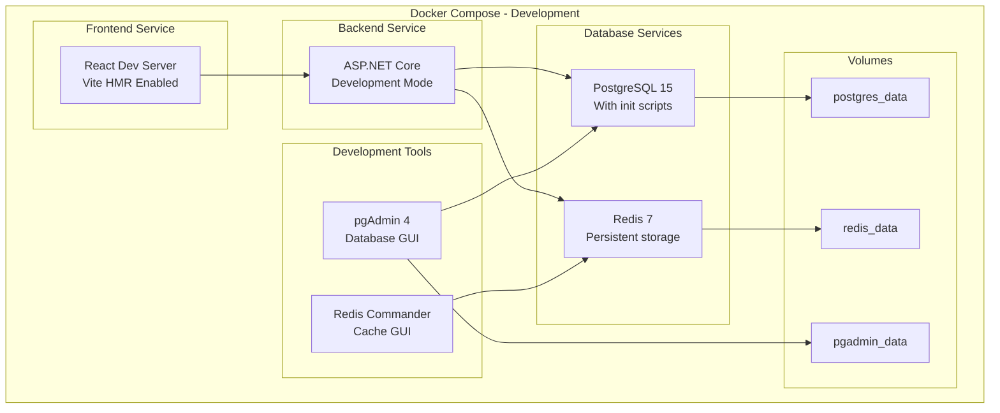
```mermaid
graph TB
    subgraph "Docker Compose - Development"
        subgraph "Frontend Service"
            REACT[React Dev Server<br/>Vite HMR Enabled]
        end

        subgraph "Backend Service"
            DOTNET[ASP.NET Core<br/>Development Mode]
        end

        subgraph "Database Services"
            PG[PostgreSQL 15<br/>With init scripts]
            RD[Redis 7<br/>Persistent storage]
        end

        subgraph "Development Tools"
            PGADM[pgAdmin 4<br/>Database GUI]
            REDGUI[Redis Commander<br/>Cache GUI]
        end

        subgraph "Volumes"
            PGDATA[postgres_data]
            REDDATA[redis_data]
            PGADMDATA[pgadmin_data]
        end
    end

    REACT --> DOTNET
    DOTNET --> PG
    DOTNET --> RD
    PGADM --> PG
    REDGUI --> RD

    PG --> PGDATA
    RD --> REDDATA
    PGADM --> PGADMDATA
```

### Docker Compose Production

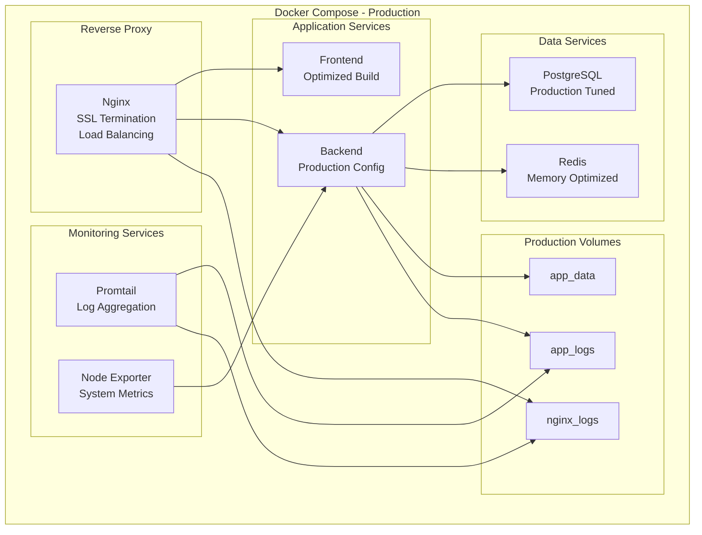
```mermaid
graph TB
    subgraph "Docker Compose - Production"
        subgraph "Reverse Proxy"
            NGINX_PROD[Nginx<br/>SSL Termination<br/>Load Balancing]
        end

        subgraph "Application Services"
            FRONTEND_SERV[Frontend<br/>Optimized Build]
            BACKEND_SERV[Backend<br/>Production Config]
        end

        subgraph "Data Services"
            PG_PROD[PostgreSQL<br/>Production Tuned]
            RD_PROD[Redis<br/>Memory Optimized]
        end

        subgraph "Monitoring Services"
            PROMTAIL_SERV[Promtail<br/>Log Aggregation]
            NODE_SERV[Node Exporter<br/>System Metrics]
        end

        subgraph "Production Volumes"
            APP_DATA[app_data]
            APP_LOGS[app_logs]
            NGINX_LOGS[nginx_logs]
        end
    end

    NGINX_PROD --> FRONTEND_SERV
    NGINX_PROD --> BACKEND_SERV
    BACKEND_SERV --> PG_PROD
    BACKEND_SERV --> RD_PROD

    PROMTAIL_SERV --> APP_LOGS
    PROMTAIL_SERV --> NGINX_LOGS
    NODE_SERV --> BACKEND_SERV

    BACKEND_SERV --> APP_DATA
    BACKEND_SERV --> APP_LOGS
    NGINX_PROD --> NGINX_LOGS
```

### CI/CD Pipeline Architecture

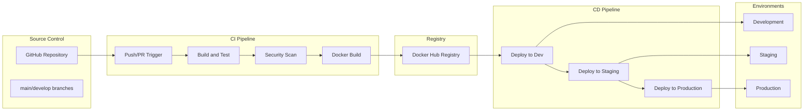
```mermaid
graph LR
    subgraph "Source Control"
        GIT[GitHub Repository]
        BRANCHES[main/develop branches]
    end

    subgraph "CI Pipeline"
        TRIGGER[Push/PR Trigger]
        BUILD[Build and Test]
        SCAN[Security Scan]
        DOCKER_BUILD[Docker Build]
    end

    subgraph "Registry"
        DOCKER_HUB[Docker Hub Registry]
    end

    subgraph "CD Pipeline"
        DEPLOY_DEV[Deploy to Dev]
        DEPLOY_STAGING[Deploy to Staging]
        DEPLOY_PROD[Deploy to Production]
    end

    subgraph "Environments"
        DEV_ENV[Development]
        STAGE_ENV[Staging]
        PROD_ENV[Production]
    end

    GIT --> TRIGGER
    TRIGGER --> BUILD
    BUILD --> SCAN
    SCAN --> DOCKER_BUILD
    DOCKER_BUILD --> DOCKER_HUB

    DOCKER_HUB --> DEPLOY_DEV
    DEPLOY_DEV --> DEV_ENV
    DEPLOY_DEV --> DEPLOY_STAGING
    DEPLOY_STAGING --> STAGE_ENV
    DEPLOY_STAGING --> DEPLOY_PROD
    DEPLOY_PROD --> PROD_ENV
```

---

## Activity Diagrams

### User Authentication Flow

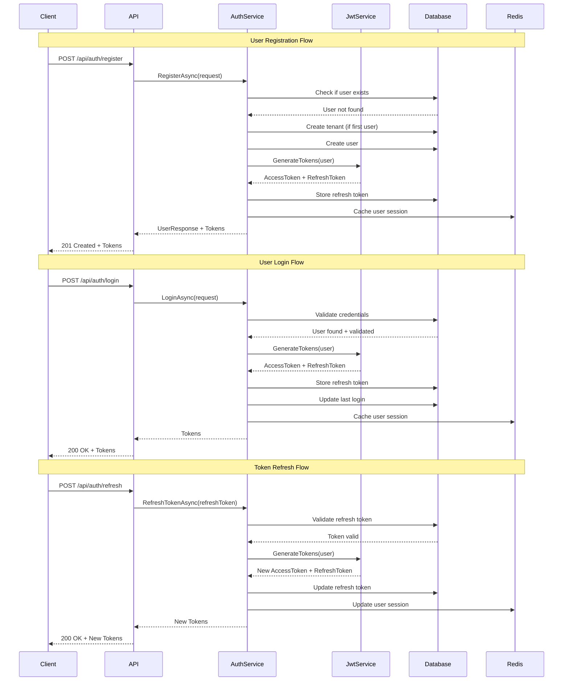
```mermaid
sequenceDiagram
    participant Client
    participant API
    participant AuthService
    participant JwtService
    participant Database
    participant Redis

    Note over Client,Redis: User Registration Flow
    Client->>API: POST /api/auth/register
    API->>AuthService: RegisterAsync(request)
    AuthService->>Database: Check if user exists
    Database-->>AuthService: User not found
    AuthService->>Database: Create tenant (if first user)
    AuthService->>Database: Create user
    AuthService->>JwtService: GenerateTokens(user)
    JwtService-->>AuthService: AccessToken + RefreshToken
    AuthService->>Database: Store refresh token
    AuthService->>Redis: Cache user session
    AuthService-->>API: UserResponse + Tokens
    API-->>Client: 201 Created + Tokens

    Note over Client,Redis: User Login Flow
    Client->>API: POST /api/auth/login
    API->>AuthService: LoginAsync(request)
    AuthService->>Database: Validate credentials
    Database-->>AuthService: User found + validated
    AuthService->>JwtService: GenerateTokens(user)
    JwtService-->>AuthService: AccessToken + RefreshToken
    AuthService->>Database: Store refresh token
    AuthService->>Database: Update last login
    AuthService->>Redis: Cache user session
    AuthService-->>API: Tokens
    API-->>Client: 200 OK + Tokens

    Note over Client,Redis: Token Refresh Flow
    Client->>API: POST /api/auth/refresh
    API->>AuthService: RefreshTokenAsync(refreshToken)
    AuthService->>Database: Validate refresh token
    Database-->>AuthService: Token valid
    AuthService->>JwtService: GenerateTokens(user)
    JwtService-->>AuthService: New AccessToken + RefreshToken
    AuthService->>Database: Update refresh token
    AuthService->>Redis: Update user session
    AuthService-->>API: New Tokens
    API-->>Client: 200 OK + New Tokens
```

### Chat Session Workflow

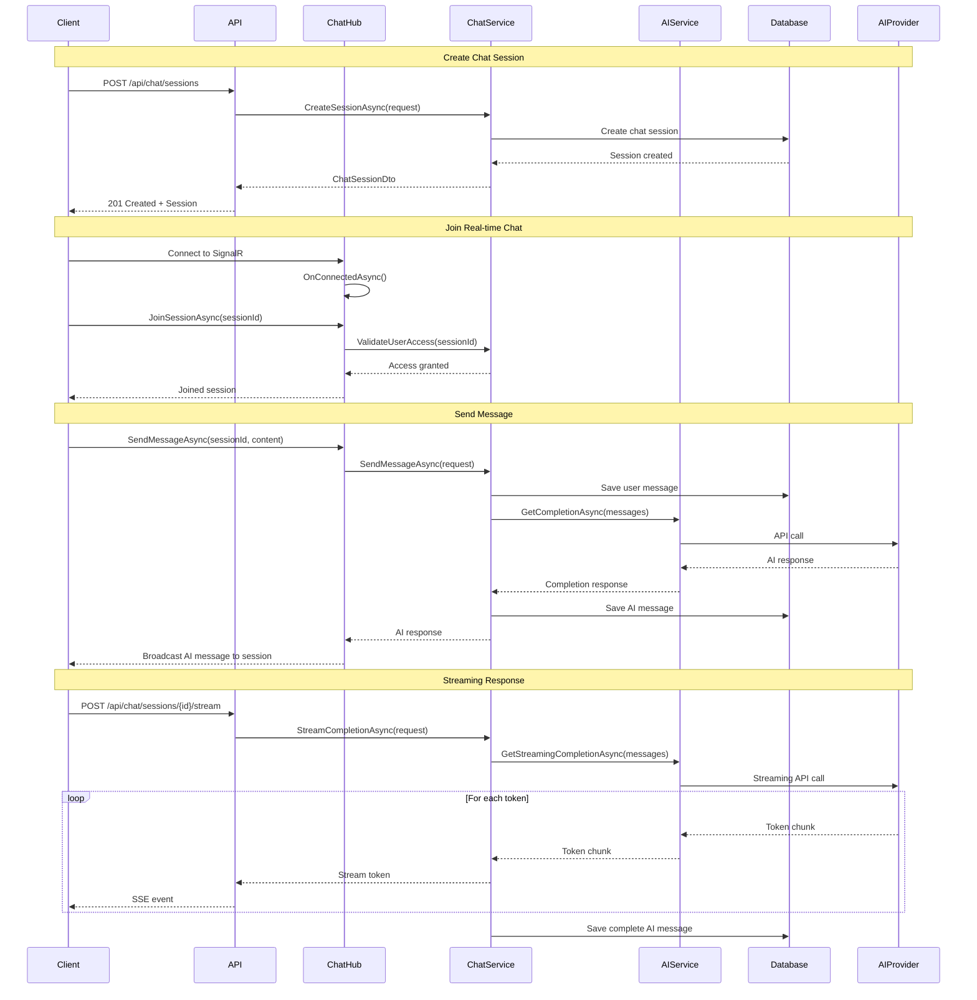
```mermaid
sequenceDiagram
    participant Client
    participant API
    participant ChatHub
    participant ChatService
    participant AIService
    participant Database
    participant AIProvider

    Note over Client,AIProvider: Create Chat Session
    Client->>API: POST /api/chat/sessions
    API->>ChatService: CreateSessionAsync(request)
    ChatService->>Database: Create chat session
    Database-->>ChatService: Session created
    ChatService-->>API: ChatSessionDto
    API-->>Client: 201 Created + Session

    Note over Client,AIProvider: Join Real-time Chat
    Client->>ChatHub: Connect to SignalR
    ChatHub->>ChatHub: OnConnectedAsync()
    Client->>ChatHub: JoinSessionAsync(sessionId)
    ChatHub->>ChatService: ValidateUserAccess(sessionId)
    ChatService-->>ChatHub: Access granted
    ChatHub-->>Client: Joined session

    Note over Client,AIProvider: Send Message
    Client->>ChatHub: SendMessageAsync(sessionId, content)
    ChatHub->>ChatService: SendMessageAsync(request)
    ChatService->>Database: Save user message
    ChatService->>AIService: GetCompletionAsync(messages)
    AIService->>AIProvider: API call
    AIProvider-->>AIService: AI response
    AIService-->>ChatService: Completion response
    ChatService->>Database: Save AI message
    ChatService-->>ChatHub: AI response
    ChatHub-->>Client: Broadcast AI message to session

    Note over Client,AIProvider: Streaming Response
    Client->>API: POST /api/chat/sessions/{id}/stream
    API->>ChatService: StreamCompletionAsync(request)
    ChatService->>AIService: GetStreamingCompletionAsync(messages)
    AIService->>AIProvider: Streaming API call
    
    loop For each token
        AIProvider-->>AIService: Token chunk
        AIService-->>ChatService: Token chunk
        ChatService-->>API: Stream token
        API-->>Client: SSE event
    end
    
    ChatService->>Database: Save complete AI message
```

### Tenant Management Workflow

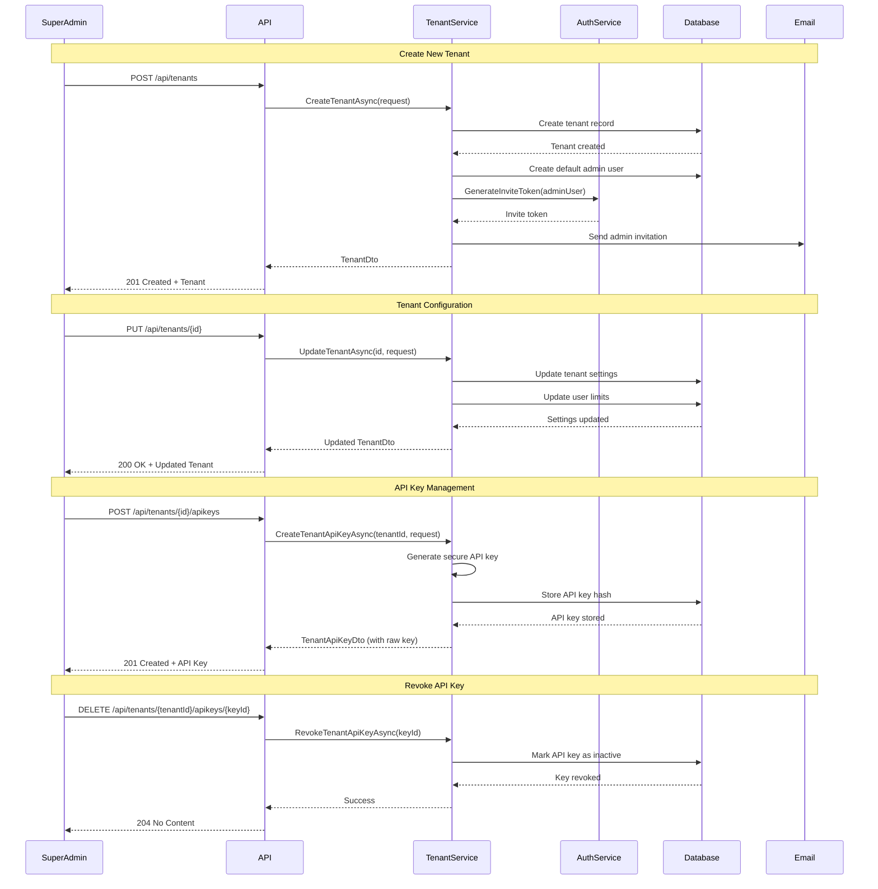
```mermaid
sequenceDiagram
    participant SuperAdmin
    participant API
    participant TenantService
    participant AuthService
    participant Database
    participant Email

    Note over SuperAdmin,Email: Create New Tenant
    SuperAdmin->>API: POST /api/tenants
    API->>TenantService: CreateTenantAsync(request)
    TenantService->>Database: Create tenant record
    Database-->>TenantService: Tenant created
    TenantService->>Database: Create default admin user
    TenantService->>AuthService: GenerateInviteToken(adminUser)
    AuthService-->>TenantService: Invite token
    TenantService->>Email: Send admin invitation
    TenantService-->>API: TenantDto
    API-->>SuperAdmin: 201 Created + Tenant

    Note over SuperAdmin,Email: Tenant Configuration
    SuperAdmin->>API: PUT /api/tenants/{id}
    API->>TenantService: UpdateTenantAsync(id, request)
    TenantService->>Database: Update tenant settings
    TenantService->>Database: Update user limits
    Database-->>TenantService: Settings updated
    TenantService-->>API: Updated TenantDto
    API-->>SuperAdmin: 200 OK + Updated Tenant

    Note over SuperAdmin,Email: API Key Management
    SuperAdmin->>API: POST /api/tenants/{id}/apikeys
    API->>TenantService: CreateTenantApiKeyAsync(tenantId, request)
    TenantService->>TenantService: Generate secure API key
    TenantService->>Database: Store API key hash
    Database-->>TenantService: API key stored
    TenantService-->>API: TenantApiKeyDto (with raw key)
    API-->>SuperAdmin: 201 Created + API Key

    Note over SuperAdmin,Email: Revoke API Key
    SuperAdmin->>API: DELETE /api/tenants/{tenantId}/apikeys/{keyId}
    API->>TenantService: RevokeTenantApiKeyAsync(keyId)
    TenantService->>Database: Mark API key as inactive
    Database-->>TenantService: Key revoked
    TenantService-->>API: Success
    API-->>SuperAdmin: 204 No Content
```

### AI Service Integration Flow

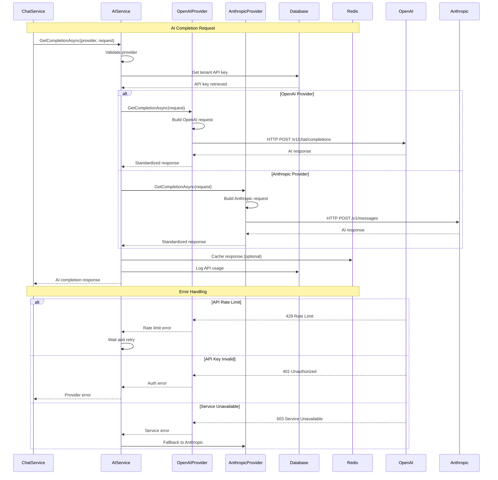
```mermaid
sequenceDiagram
    participant ChatService
    participant AIService
    participant OpenAIProvider
    participant AnthropicProvider
    participant Database
    participant Redis

    Note over ChatService,Redis: AI Completion Request
    ChatService->>AIService: GetCompletionAsync(provider, request)
    AIService->>AIService: Validate provider
    AIService->>Database: Get tenant API key
    Database-->>AIService: API key retrieved

    alt OpenAI Provider
        AIService->>OpenAIProvider: GetCompletionAsync(request)
        OpenAIProvider->>OpenAIProvider: Build OpenAI request
        OpenAIProvider->>OpenAI: HTTP POST /v1/chat/completions
        OpenAI-->>OpenAIProvider: AI response
        OpenAIProvider-->>AIService: Standardized response
    else Anthropic Provider
        AIService->>AnthropicProvider: GetCompletionAsync(request)
        AnthropicProvider->>AnthropicProvider: Build Anthropic request
        AnthropicProvider->>Anthropic: HTTP POST /v1/messages
        Anthropic-->>AnthropicProvider: AI response
        AnthropicProvider-->>AIService: Standardized response
    end

    AIService->>Redis: Cache response (optional)
    AIService->>Database: Log API usage
    AIService-->>ChatService: AI completion response

    Note over ChatService,Redis: Error Handling
    alt API Rate Limit
        OpenAI-->>OpenAIProvider: 429 Rate Limit
        OpenAIProvider-->>AIService: Rate limit error
        AIService->>AIService: Wait and retry
    else API Key Invalid
        OpenAI-->>OpenAIProvider: 401 Unauthorized
        OpenAIProvider-->>AIService: Auth error
        AIService-->>ChatService: Provider error
    else Service Unavailable
        OpenAI-->>OpenAIProvider: 503 Service Unavailable
        OpenAIProvider-->>AIService: Service error
        AIService->>AnthropicProvider: Fallback to Anthropic
    end
```

---

## Security Architecture

### Authentication and Authorization Flow

```mermaid
graph TB
    subgraph "Client"
        USER[User]
        BROWSER[Browser/App]
    end

    subgraph "API Gateway"
        MIDDLEWARE[Auth Middleware]
        JWT_VALIDATION[JWT Validation]
    end

    subgraph "Authentication Service"
        AUTH_SVC[Auth Service]
        JWT_SVC[JWT Service]
        HASH_SVC[Password Hasher]
    end

    subgraph "Authorization"
        ROLE_CHECK[Role-based Access]
        TENANT_CHECK[Tenant Isolation]
        RESOURCE_CHECK[Resource Access]
    end

    subgraph "Storage"
        TOKEN_STORE[(Refresh Tokens)]
        USER_STORE[(User Data)]
        SESSION_CACHE[(Session Cache)]
    end

    USER --> BROWSER
    BROWSER --> MIDDLEWARE
    MIDDLEWARE --> JWT_VALIDATION
    JWT_VALIDATION --> AUTH_SVC
    AUTH_SVC --> JWT_SVC
    AUTH_SVC --> HASH_SVC
    
    JWT_VALIDATION --> ROLE_CHECK
    ROLE_CHECK --> TENANT_CHECK
    TENANT_CHECK --> RESOURCE_CHECK
    
    AUTH_SVC --> TOKEN_STORE
    AUTH_SVC --> USER_STORE
    JWT_VALIDATION --> SESSION_CACHE
```

### Data Security Layers

```mermaid
graph LR
    subgraph "Transport Security"
        TLS[TLS 1.3 Encryption]
        HTTPS[HTTPS Only]
    end

    subgraph "Application Security"
        JWT[JWT Tokens]
        CORS[CORS Policy]
        VALIDATION[Input Validation]
        SANITIZATION[Data Sanitization]
    end

    subgraph "Data Security"
        ENCRYPTION[Password Hashing]
        TENANT_ISOLATION[Tenant Data Isolation]
        API_KEYS[Encrypted API Keys]
    end

    subgraph "Infrastructure Security"
        FIREWALL[Network Firewall]
        SECRETS[Secret Management]
        MONITORING[Security Monitoring]
    end

    TLS --> JWT
    HTTPS --> CORS
    JWT --> ENCRYPTION
    CORS --> TENANT_ISOLATION
    VALIDATION --> API_KEYS
    SANITIZATION --> SECRETS
    
    FIREWALL --> MONITORING
```

---

## Technology Stack

### Backend Technology Stack

```mermaid
mindmap
  root)Backend Stack(
    Framework
      ASP.NET Core 8
      C# 12
      .NET 8 Runtime
    Data Access
      Entity Framework Core
      PostgreSQL Driver
      Redis Client
    Authentication
      JWT Bearer
      BCrypt Password Hashing
      Role-based Authorization
    Real-time
      SignalR
      WebSocket Support
    AI Integration
      OpenAI SDK
      Anthropic SDK
      HTTP Clients
    Testing
      xUnit
      SpecFlow BDD
      FluentAssertions
      TestContainers
```

### Frontend Technology Stack

```mermaid
mindmap
  root)Frontend Stack(
    Framework
      React 18
      TypeScript
      Vite Build Tool
    Styling
      Tailwind CSS
      CSS Modules
      Responsive Design
    State Management
      React Context
      Custom Hooks
      Local Storage
    Communication
      Axios HTTP Client
      SignalR Client
      WebSocket
    Development
      ESLint
      Prettier
      Hot Module Replacement
    Testing
      Jest
      React Testing Library
      Cypress E2E
```

### Infrastructure Technology Stack

```mermaid
mindmap
  root)Infrastructure Stack(
    Containerization
      Docker
      Docker Compose
      Multi-stage Builds
    Database
      PostgreSQL 15
      Redis 7
      Connection Pooling
    Web Server
      Nginx
      SSL/TLS
      Load Balancing
    CI/CD
      GitHub Actions
      Docker Hub
      Automated Testing
    Monitoring
      Health Checks
      Logging
      Metrics Collection
    Security
      Environment Variables
      Secret Management
      Network Isolation
```

---

## Performance Considerations

### Caching Strategy

```mermaid
graph TB
    subgraph "Client-Side Caching"
        BROWSER_CACHE[Browser Cache]
        LOCAL_STORAGE[Local Storage]
        SERVICE_WORKER[Service Worker]
    end

    subgraph "API-Level Caching"
        RESPONSE_CACHE[Response Caching]
        OUTPUT_CACHE[Output Caching]
        MEMORY_CACHE[In-Memory Cache]
    end

    subgraph "Data-Level Caching"
        REDIS_CACHE[Redis Cache]
        EF_CACHE[EF Core Query Cache]
        DISTRIBUTED_CACHE[Distributed Cache]
    end

    subgraph "Database Optimization"
        DB_INDEXES[Database Indexes]
        QUERY_OPTIMIZATION[Query Optimization]
        CONNECTION_POOLING[Connection Pooling]
    end

    BROWSER_CACHE --> RESPONSE_CACHE
    LOCAL_STORAGE --> MEMORY_CACHE
    SERVICE_WORKER --> OUTPUT_CACHE
    
    RESPONSE_CACHE --> REDIS_CACHE
    MEMORY_CACHE --> EF_CACHE
    OUTPUT_CACHE --> DISTRIBUTED_CACHE
    
    REDIS_CACHE --> DB_INDEXES
    EF_CACHE --> QUERY_OPTIMIZATION
    DISTRIBUTED_CACHE --> CONNECTION_POOLING
```

### Scalability Architecture

```mermaid
graph TB
    subgraph "Horizontal Scaling"
        LOAD_BALANCER[Load Balancer]
        APP_INSTANCES[Multiple App Instances]
        DATABASE_REPLICAS[Database Read Replicas]
    end

    subgraph "Vertical Scaling"
        CPU_SCALING[CPU Scaling]
        MEMORY_SCALING[Memory Scaling]
        STORAGE_SCALING[Storage Scaling]
    end

    subgraph "Microservices Ready"
        SERVICE_SEPARATION[Service Separation]
        API_VERSIONING[API Versioning]
        MESSAGE_QUEUES[Message Queues]
    end

    LOAD_BALANCER --> APP_INSTANCES
    APP_INSTANCES --> DATABASE_REPLICAS
    
    CPU_SCALING --> MEMORY_SCALING
    MEMORY_SCALING --> STORAGE_SCALING
    
    SERVICE_SEPARATION --> API_VERSIONING
    API_VERSIONING --> MESSAGE_QUEUES
```

---

This architecture documentation provides a comprehensive overview of the GenAI Boilerplate .NET application's design, structure, and deployment strategies. The use of Mermaid diagrams ensures that the documentation is maintainable and can be easily updated as the system evolves.

For implementation details and code examples, refer to the respective project files and documentation in the codebase.
